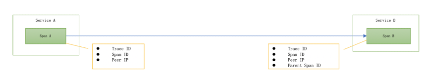
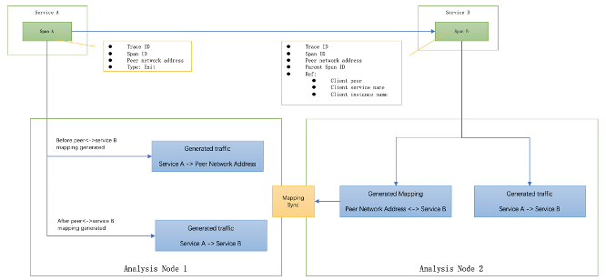
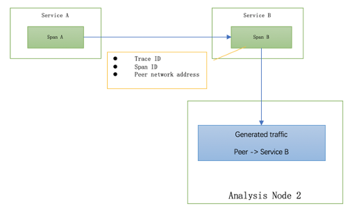
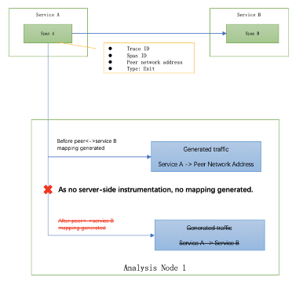
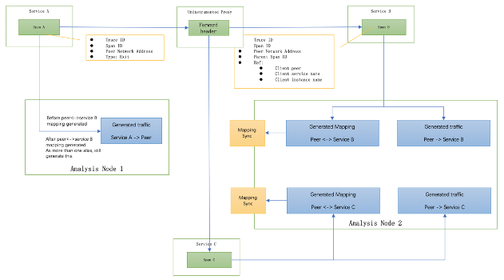

# STAM: 为高度分布式系统和大规模应用系统增强拓扑自动检测

- Sheng Wu 吴 晟
- wusheng@apache.org
- Yanlong He 何延龙 (翻译)
- heyanlong@apache.org

# 摘要
对大型分布式系统进行监控、可视化和故障排除一直是一个难题。当前使用的一种常见工具是分布式追踪系统（如：Google Dapper）[1]，他可以根据trace数据来检测topology和metrics。当前topology检测的一大局限性在于，只能根据指定的时间范围的trace来推断服务之间的依赖关系。这样会导致更多的延迟和内存使用，因为在高度分布式的系统中，每个PRC的客户端和服务端都必须匹配数百万个随机发生的请求。更重要的是，如果客户端和服务端之间的RPC持续时间大于之前设置的时间窗口或者跨越两个窗口，它将无法进行匹配。

在本文中，我们提出流式拓扑分析方法 STAM(Streaming Topology Analysis Method)。在STAM中, 我们可以使用自动检测或手动检测机制在客户端与服务器拦截或修改PRC。对于自动检测，STAM会实时处理应用程序代码，例如Java代理。因此，这个监控系统不需要应用程序开发团队或RPC框架开发团队修改任何源代码。STAM将客户端使用的RPC网络地址、服务名称和服务实例名称注入到RPC上下文，并将服务端的服务名称和服务实例名称邦定为客户端使用的网络地址别名。将依赖分析从导致阻塞和延迟的机制中解放出来，分析核心可以已流式处理监控数据并生产精确的拓扑。

STAM已在ASF（Apache Software Foundation）的一个开源APM（application performance monitoring system）项目 Apache SkyWalking[2]中实施，该项目已在许多大型企业的生产环境中广泛使用[3]，其中包括阿里巴巴、华为、腾讯、滴滴、小米、中国移动和其他企业（航空公司、金融机构等）。它具有更好的水平缩放特性，可显著降低负载和内存成本。

# 介绍
监控高度分布式系统，尤其是使用微服务架构的非常复杂。许多的PRC调用，包括HTTP、gPRC、MQ、Cache和数据库的访问都在单个客户端请求之后。让IT团队了解数千个服务之间的依赖关系是系统可观察性的关键所在也是第一步。分布式追踪系统能够收集追踪，包括所有的分布式请求路径。逻辑上已经将依赖关系包含在追踪数据中，例如Zipkin [4] 或者 Jaeger Tracing [10]，之类的分布式追踪系统提供了内置的依赖关系分析功能，但许多分析功能都基于此方案。至少有两个基本条件：实时性和一致性。

需要高性能的实时性来匹配分布式应用程序系统依赖关系的可变性，包括服务级别和服务实例级别的依赖。

服务是具有相同功能或代码的实例组。

服务实例通常是指系统级别的进程，例如JVM进程。服务和实例之间的关系是可变的，具体取决于配置、代码和网络状态。依赖关系可能会随着时间而变化。

 
图 1, 在传统的Dapper系统中生成的spans。

Dapper论文中的span模型和现有追踪系统（例如：Zipkin instrumenting mode[9]）只是将spam id传播到服务端。由于这种模式，依赖分析需要一定的时间窗口。因为记录了关系，所以在客户端和服务端都收集了span。因此，分析过程必须等待客户端和服务端span在同一时间窗口内才能匹配，才能输出结果：Service A依赖 Service B。因此，RPC请求必须在此时间窗口内，否则，将丢失依赖关系。这种情况使得分析系统不会在第二级反应依赖变化，在生产环境中，有时必须将时间窗口设置为3到5分钟。

另外，基于时间窗口的设计，如果一侧涉及到长时间运行的任务，那么就很难轻松的获取精确的依赖关系。因为为了使分析尽可能的快速，所以分析时间必须少于5分钟。但是，如果分析数据不完整或跨越两个时间窗口，则某些span将无法匹配父级或子级，即使我们添加一种机制来处理前一阶段剩余的span，仍然必须放弃一些机制来保证数据集大小和内存使用合理性。

在STAM中，我们使用新的分析方法介绍了新的span和上下文传播模型。with the new analysis method. These new models add the peer network address (IP or hostname) used at client side, client service instance name and client service name, into the context propagation model. Then it passes the RPC call from client to server, just as the original trace id and span id in the existing tracing system, and collects it in the server-side span. The new analysis method can easily generate the client-server relationship directly without waiting on the client span. It also sets the peer network address as one alias of the server service. After the across cluster node data sync, the client-side span analysis could use this alias metadata to generate the client-server relationship directly too. By using these new models and method in Apache SkyWalking, we remove the time windows-based analysis permanently, and fully use the streaming analysis mode with less than 5 seconds latency and consistent accuracy

# New Span Model and Context Model
The traditional span of a tracing system includes the following fields [1][6][10].
- A trace id to represent the whole trace.
- A span id to represent the current span.
- An operation name to describe what operation this span did.
- A start timestamp.
- A finish timestamp
- Service and Service Instance names of current span.
- A set of zero or more key:value Span Tags. 
- A set of zero or more Span Logs, each of which is itself a key:value map paired with a timestamp. 
- References to zero or more causally related Spans. Reference includes the parent span id and trace id.

In the new span model of STAM we add the following fields in the span.

**Span type**. Enumeration, including exit, local and entry. Entry and Local spans are used in a networking related library. Entry spans represent a server-side networking library, such as Apache Tomcat[7]. Exit spans represent the client-side networking library, such as Apache HttpComponents [8].
**Peer Network Address**. Remote "address," suitable for use in exit and entry spans. In Exit spans, the peer network address is the address by the client library to access the server.

These fields usually are optionally included in many tracing system,. But in STAM, we require them in all RPC cases.

**Context Model** is used to propagate the client-side information to server-side carried by the original RPC call, usually in the header, such as HTTP header or MQ header. In the old design, it carries the trace id and span id of client-side span. In the STAM, we enhance this model, adding the parent service name, parent service instance name and peer of exit span. The names could be literal strings. All these extra fields will help to remove the block of streaming analysis. Compared to the existing context model, this uses a little more bandwidth, but it could be optimized. In Apache SkyWalking, we design a register mechanism to exchange unique IDs to represent these names. As a result, only 3 integers are added in the RPC context, so the increase of bandwidth is at least less than 1% in the production environment.

The changes of two models could eliminate the time windows in the analysis process. Server-side span analysis enhances the context aware capability.

# New Topology Analysis Method
The new topology analysis method at the core of STAM is processing the span in stream mode.
The analysis of the server-side span, also named entry span, includes the parent service name, parent service instance name and peer of exit span. So the analysis process could establish the following results.
1.	Set the peer of exit span as client using alias name of current service and instance. `Peer network address <-> service name` and `peer network address <-> Service instance name` aliases created. These two will sync with all analysis nodes and save storage, allowing more analysis processers to have this alias information.
2.	Generate relationships of `parent service name -> current service name` and `parent service instance name -> current service instance name`, unless there is another different `Peer network address <-> Service Instance Name` mapping found. In that case, only generate relationships of `peer network address <-> service name` and `peer network address <-> Service instance name`.

For analysis of the client-side span (exit span), there could three possibilities. 
1.	The peer in the exit span already has the alias names established by server-side span analysis from step (1). Then use alias names to replace the peer, and generate traffic of `current service name -> alias service name` and `current service instance name -> alias service instance name`.
2.	If the alias could not be found, then just simply generate traffic for `current service name -> peer` and `current service instance name -> peer`.
3.	If multiple alias names of `peer network address <-> Service Instance Name` could be found, then keep generating traffic for `current service name -> peer network address` and `current service instance name -> peer network address`.

 
Figure 2, Apache SkyWalking uses STAM to detect and visualize the topology of distributed systems.

# Evaluation
In this section, we evaluate the new models and analysis method in the context of several typical cases in which the old method loses timeliness and consistent accuracy.

1.	**New Service Online or Auto Scale Out**

New services could be added into the whole topology by the developer team randomly, or container operation platform automatically by some scale out policy, like Kubernetes [5]. The monitoring system could not be notified in any case manually. By using STAM, we could detect the new node automatically and also keep the analysis process unblocked and consistent with detected nodes. 
In this case, a new service and network address (could be IP, port or both) are used. The peer network address <-> service mapping does not exist, the traffic of client service -> peer network address will be generated and persistent in the storage first. After mapping is generated, further traffic of client-service to server-service could be identified, generated and aggregated in the analysis platform. For filling the gap of a few traffic before the mapping generated, we require doing peer network address <-> service mapping translation again in query stage, to merge client service->peer network address and client-service to server-service. In production, the amount of VM for the whole SkyWalking analysis platform deployment is less than 100, syncing among them will finish less than 10 seconds, in most cases it only takes 3-5 seconds. And in the query stage, the data has been aggregated in minutes or seconds at least. The query merge performance is not related to how much traffic happens before the mapping generated, only affected by sync duration, in here, only 3 seconds. Due to that, in minute level aggregation topology, it only adds 1 or 2 relationship records in the whole topology relationship dataset. Considering an over 100 services topology having over 500 relationship records per minute, the payload increase for this query merge is very limited and affordable. This feature is significant in a large and high load distributed system, as we don’t need to concern its scaling capability. And in some fork versions, they choose to update the existing client service->peer network address to client-service to server-service after detecting the new mapping for peer generated, in order to remove the extra load at query stage permanently.

 
Figure 3, Span analysis by using the new topology analysis method

2.	**Existing Uninstrumented Nodes**

Every topology detection method has to work in this case. In many cases, there are nodes in the production environment that can’t be instrumented. Causes for this might include:(1) Restriction of the technology. In some golang or C++ written applications, there is no easy way in Java or .Net to do auto instrumentation by the agent. So, the codes may not be instrumented automatically. (2) The middleware, such as MQ, database server, has not adopted the tracing system. This would make it difficult or time consuming to implement the middleware instrumentation. (3) A 3rd party service or cloud service doesn’t support work with the current tracing system. (4) Lack of resources: e.g., the developer or operation team lacks time to make the instrumentation ready. 

The STAM works well even if the client or server side has no instrumentation. It still keeps the topology as accurate as possible.

If the client side hasn’t instrumented, the server-side span wouldn’t get any reference through RPC context, so, it would simply use peer to generate traffic, as shown in Figure 4. 

 
Figure 4, STAM traffic generation when no client-side instrumentation

As shown in Figure 5, in the other case, with no server-side instrumentation, the client span analysis doesn’t need to process this case. The STAM analysis core just simply keeps generating client service->peer network address traffic. As there is no mapping for peer network address generated, there is no merging. 

 
Figure 5, STAM traffic generation when no server-side instrumentation

3.	**Uninstrumented Node Having Header Forward Capability**

Besides the cases we evaluated in (2) Uninstrumented Nodes, there is one complex and special case: the instrumented node has the capability to propagate the header from downstream to upstream, typically in all proxy, such as Envoy[11], Nginx[12], Spring Cloud Gateway[13]. As proxy, it has the capability to forward all headers from downstream to upstream to keep some of information in the header, including the tracing context, authentication, browser information, and routing information, in order to make them accessible by the business services behind the proxy, like Envoy route configuration [14]. When some proxy can’t be instrumented, no matter what the reason, it should not affect the topology detection. 

In this case, the proxy address would be used at the client side and propagate through RPC context as peer network address, and the proxy forwards this to different upstream services. Then STAM could detect this case and generate the proxy as a conjectural node. In the STAM, more than one alias names for this network address should be generated. After those two are detected and synchronized to the analysis node, the analysis core knows there is at least one uninstrumented service standing between client and servers. So, it will generate the relationships of `client service->peer network address`, `peer->server service B` and `peer network address ->server service B`, as shown in Figure 6.

 
Figure 6, STAM traffic generation when the proxy uninstrumentatio

# Conclusion

This paper described the STAM, which is to the best of our knowledge the best topology detection method for distributed tracing systems. It replaces the time-window based topology analysis method for tracing-based monitoring systems. It removes the resource cost of disk and memory for time-window baseds analysis permanently and totally, and the barriers of horizontal scale. One STAM implementation, Apache SkyWalking, is widely used for monitoring hundreds of applications in production. Some of them generated over 100 TB tracing data per day and topology for over 200 services in real time.

# Acknowledgments 
We thank all contributors of Apache SkyWalking project for suggestions, code contributions to implement the STAM, and feedback from using the STAM and SkyWalking in their production environment.

# License
This paper and the STAM are licensed in the [Apache 2.0](LICENSE)

# References

1. Dapper, a Large-Scale Distributed Systems Tracing Infrastructure, https://research.google.com/pubs/pub36356.html?spm=5176.100239.blogcont60165.11.OXME9Z
1. Apache SkyWalking, http://skywalking.apache.org/ 
1. Apache Open Users, https://github.com/apache/skywalking/blob/master/docs/powered-by.md
1. Zipkin, https://zipkin.io/
1. Kubernetes, Production-Grade Container Orchestration. Automated container deployment, scaling, and management. https://kubernetes.io/
1. OpenTracing Specification https://github.com/opentracing/specification/blob/master/specification.md
1. Apache Tomcat, http://tomcat.apache.org/
1. Apache HttpComponents, https://hc.apache.org/
1. Zipkin doc, ‘Instrumenting a library’ section, ‘Communicating trace information’ paragraph. https://zipkin.io/pages/instrumenting
1. Jaeger Tracing, https://jaegertracing.io/
1. Envoy Proxy, http://envoyproxy.io/
1. Nginx, http://nginx.org/
1. Spring Cloud Gateway, https://spring.io/projects/spring-cloud-gateway
1. Envoy Route Configuration, https://www.envoyproxy.io/docs/envoy/latest/api-v2/api/v2/rds.proto.html?highlight=request_headers_to_
